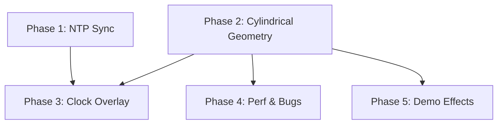

# Roadmap: Моя Лампа

**Created:** 2026-06-02
**Granularity:** Standard (5-8 phases)
**Core Value:** Живое программирование света — пользователь пишет код эффекта в браузере и мгновенно видит его на LED-матрице лампы.

---

## Phase 1: NTP — Синхронизация времени

**Goal:** Устройство получает точное время по NTP после подключения к Wi-Fi.

**Why first:** Время — фундаментальная зависимость для часов (Phase 3). Без работающего NTP часы не имеют смысла.

**Dependencies:** None (standalone fix)

**Requirements:** NTP-01, NTP-02

**Success criteria:**
- Устройство синхронизирует время с NTP-сервером в течение 30 секунд после подключения к Wi-Fi
- `TimeRuntimeService::getCurrentTime()` возвращает корректное время
- Время не сбрасывается до перезагрузки устройства

---

## Phase 2: CYL — Цилиндрическая геометрия матрицы

**Goal:** `MatrixLayout` и `FrameBuffer` переведены с плоской панели на цилиндр. Все существующие эффекты корректно отображаются.

**Why second:** Это фундаментальное изменение системы координат. Все эффекты, DSL и часы зависят от правильной геометрии.

**Dependencies:** None (independent architectural change)

**Requirements:** CYL-01, CYL-02, CYL-03, CYL-04, CYL-05, CYL-06

**Success criteria:**
- Пиксель на угле 0° и пиксель на угле 360° — соседи (wraparound)
- `fillRect(0, 0, 32, 16)` заполняет всю матрицу без разрывов
- Все существующие эффекты из `EffectRegistry` визуально корректны на цилиндре
- Все тесты `test_framebuffer` и `test_effects` проходят

---

## Phase 3: CLOCK — Часы на цилиндре

**Goal:** Часы корректно отображаются как оверлей на цилиндрической LED-матрице.

**Why third:** Зависит от NTP (Phase 1 — источник времени) и цилиндра (Phase 2 — правильная геометрия для отрисовки цифр).

**Dependencies:** Phase 1 (NTP), Phase 2 (Cylinder)

**Requirements:** CLOCK-01, CLOCK-02, CLOCK-03

**Success criteria:**
- Часы видны поверх активного эффекта
- Цифры не искажены на цилиндрической поверхности
- Переключение 12h/24h работает через веб-интерфейс

---

## Phase 4: PERF — Баги и производительность

**Goal:** Устранены визуальные артефакты, мерцание, дебаг-хартбит. Стабильный фреймрейт.

**Why fourth:** После изменения геометрии (Phase 2) могут проявиться новые баги отрисовки. Чиним после того как базовая геометрия стабилизировалась.

**Dependencies:** Phase 2 (Cylinder) — для осмысленного тестирования отрисовки

**Requirements:** PERF-01, PERF-02, PERF-03

**Success criteria:**
- Нет видимого мерцания при смене эффектов
- Фреймрейт стабилен при рендеринге DSL-эффектов средней сложности
- В релизной сборке нет дебаг-паттернов

---

## Phase 5: DSL — Демо-эффекты и расширение языка

**Goal:** Добавлены крутые демо-эффекты (спрайтовая анимация), при необходимости расширен Lux DSL.

**Why last:** Демо-эффекты — вишенка на торте. Язык расширяется только если нужно для конкретных примеров.

**Dependencies:** Phase 2 (Cylinder) — эффекты должны работать в правильной геометрии

**Requirements:** DSL-01, DSL-02, DSL-03

**Success criteria:**
- Хотя бы один эффект с анимацией спрайта работает на цилиндре (например, Марио бегает по кругу)
- Демо-эффекты доступны как пресеты в веб-интерфейсе
- Если DSL расширен — существующие эффекты обратно совместимы

---

## Phase Dependency Graph

**Parallel execution:** P1 и P2 независимы — могут выполняться параллельно.

---

## Summary

| Phase | Name | Reqs | Depends On |
|-------|------|------|------------|
| 1 | NTP Sync | 2 | — |
| 2 | Cylindrical Geometry | 6 | — |
| 3 | Clock Overlay | 3 | P1, P2 |
| 4 | Perf & Bugs | 3 | P2 |
| 5 | Demo Effects & DSL | 3 | P2 |

**Total:** 5 phases, 17 requirements

---
*Created: 2026-06-02*
*Last updated: 2026-06-02 after initialization*
